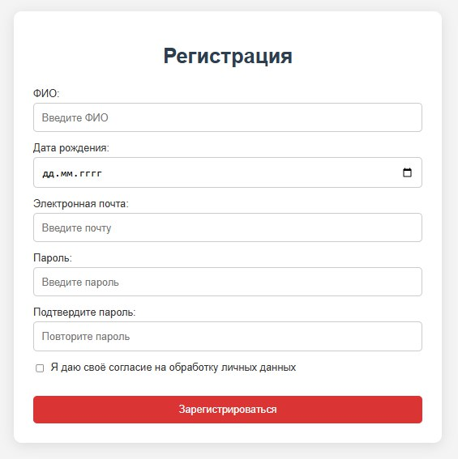
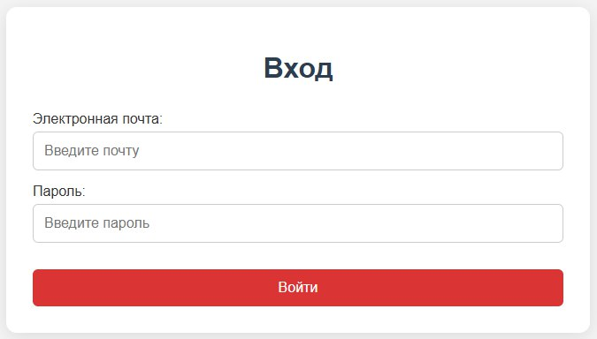

AutoZAPCHASTI
============
[](https://github.com/IgorAntun/node-chat/stargazers) [](https://github.com/IgorAntun/node-chat/issues) [](https://github.com/IgorAntun/node-chat) [](https://igorantun.com/chat) [](https://gitter.im/IgorAntun/node-chat?utm_source=badge&utm_medium=badge&utm_campaign=pr-badge)


Добро пожаловать на наш сайт автозапчастей! Здесь вы можете найти широкий ассортимент запчастей для автомобилей, а также полезные советы и информацию о ремонте и обслуживании автомобилей.


---
## Buy me a coffee

Whether you use this project, have learned something from it, or just like it, please consider supporting it by buying me a coffee, so I can dedicate more time on open-source projects like this :)

<a href="https://3isip-722.github.io/GOYDA-/pages/" target="_blank"></a>

---
### Качественные автозапчасти для иномарок в нашем интернет-магазине
AutoZAPCHASTI – один из ведущих поставщиков автозапчастей в России. Мы напрямую сотрудничаем с импортерами, у нас можно заказать любые комплектующие для автомобилей и получить их в течение 24 часов. Для подбора нужной детали на сайте можно воспользоваться поиском, отметив номер в поисковой строке или выбрать онлайн по марке машины, указав модель и модификацию.
Сотрудничество с нами уже оценили тысячи благодарных клиентов:

- Большой выбор, каталог товаров включает более 3 млн. автозапчастей;
- Быстрая доставка комплектующих для автомобилей в течение суток;
- Только оригинальные детали от ведущих производителей, продажа напрямую от импортера;
- Справедливая цена на все комплектующие, покупка без комиссий и переплат;
- В нашем интернет магазине гарантированный возврат и обмен.
- Большой ассортимент запчастей для иномарок в Москве
- Наше неоспоримое преимущество – широкий выбор комплектующих для автомобилей, быстрая продажа и доставка товаров в любой уголок России. На сайте представлена продукция 30 топовых брендов, в нашем каталоге товаров можно сразу выбрать нужные автозапчасти в режиме онлайн и получить их в течение 24 часов.
  
Это очень удобно:
- Ваша машина не простаивает в автосервисе, вы получаете автозапчасти для ремонта на следующий день;
- Любую экстренную поломку можно устранить самостоятельно, заказав детали на сайте;
- Мы быстро отправляем любые комплектующие для иномарок и экономим ваше время.
- Если вы не смогли найти автозапчасти, наши специалисты помогут с выбором: ежедневно работает онлайн-консультант, также с нами можно связаться по форме обратной связи, которая указана на сайте. У нас можно купить оригинальные комплектующие для автомобилей и заказать доставку.

Качественное обслуживание в нашем-интернет-магазине
AutoZAPCHASTI – лидер на Российском рынке, подтвердивший свою квалификацию и профессионализм. Ежедневно к нам на сайт заходят тысячи посетителей, многие становятся нашими постоянными клиентами.
Сотрудники магазина вежливые, коммуникабельные, смогут подобрать автозапчасти по артикулу, модели, серии или по году выпуска машины. Каждый заказчик может рассчитывать на квалифицированную поддержку, качественное обслуживание и умеренные цены!


<a href="https://3isip-722.github.io/GOYDA-/pages/index_login.html" target="_blank"></a>
---
2. Разработанна страница регистрации, поля дают исчерпывающее предстваления для дальнейших взаимодействий с пользователем.

<a href="https://3isip-722.github.io/GOYDA-/pages/index_login.html" target="_blank"></a>
---
3. Разработанна страница авторизации, кнопки и поля выполнены в лаконичных тонах для удобного и понятного взаимодествия.

<a href="https://3isip-722.github.io/GOYDA-/pages/index_login.html" target="_blank"></a>
---
Здесь произходит регистрация

## Установка

Чтобы запустить проект локально, выполните следующие шаги:

1. Клонируйте репозиторий:
   ```bash
   git clone https://github.com/ваш-логин/ваш-репозиторий.git
   ```

2. Перейдите в директорию проекта:
   ```bash
   cd ваш-репозиторий
   ```

3. Установите необходимые зависимости:
   ```bash
   npm install
   ```

4. Запустите локальный сервер:
   ```bash
   npm start
   ```

Теперь вы можете открыть браузер и перейти по адресу `http://localhost:3000`, чтобы увидеть сайт в действии.

## Используемые технологии

- HTML
- CSS
- JavaScript

## Вклад

Если вы хотите внести свой вклад в проект, пожалуйста, создайте форк репозитория, внесите изменения и создайте pull request. Мы будем рады вашим предложениям и улучшениям!

## Контакты

Если у вас есть вопросы или предложения, вы можете связаться с нами по электронной почте: [ваша_почта@example.com](mailto:ваша_почта@example.com).


---

## License
>You can check out the full license [here](https://github.com/IgorAntun/node-chat/blob/master/LICENSE)

This project is licensed under the terms of the **MIT** license.
